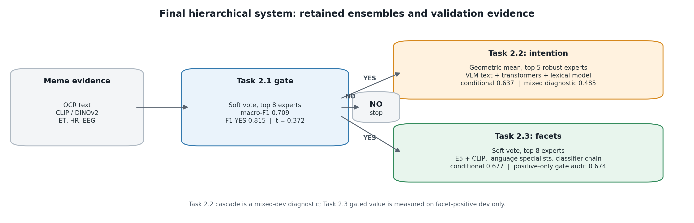
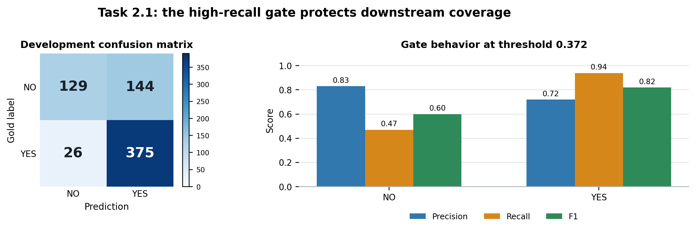
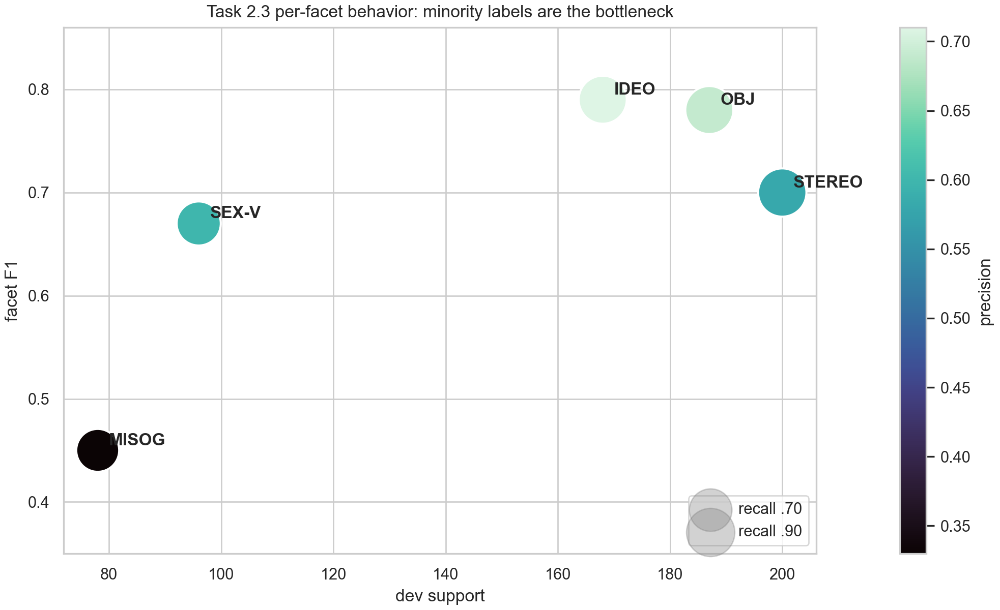

# Multimodal Sexism Identification and Characterization in Memes

**Serrano Team · Top-5 project in the LNR EXIST 2026 challenge**

[](https://www.python.org/)
[](notebooks/00_project_overview.ipynb)
[](https://nlp.uned.es/exist2026/)
[](docs/EVIDENCE_AUDIT.md)

This repository presents Serrano Team's hierarchical multimodal system for the three [EXIST 2026](https://nlp.uned.es/exist2026/) meme tasks: binary sexism identification, source-intention classification, and multilabel sexism-facet classification. The project combines OCR text, meme images, multilingual language models, and physiological signals from eye tracking, heart rate, and EEG.

The work was recognized as a **Top-5 project in the LNR challenge** built around EXIST 2026. The complete technical account is available in the [final report](report/serrano-team-exist2026-report.pdf). All headline values in this repository are aligned with that report.



## Executive summary

Sexism in a meme is rarely expressed through one clean sentence. Meaning can depend on the interaction between OCR text, visual framing, cultural context, irony, and the annotators' interpretation. The system was therefore designed around one central idea: **different representations make different errors, and those errors should be combined only when the validation evidence shows that they are complementary**.

The final solution is a hierarchical late-fusion pipeline:

1. Task 2.1 decides whether a meme is sexist. Its threshold deliberately favours recall for `YES`, because a false `NO` prevents both downstream tasks from ever recovering the correct labels.
2. Task 2.2 distinguishes `DIRECT` sexism from `JUDGEMENTAL` content that reports, condemns, or discusses sexism. This is the most semantically subtle stage and the main routing bottleneck.
3. Task 2.3 assigns one or more sexism facets. It uses label-specific thresholds because prevalence and difficulty differ substantially across facets.

This was not a search for the single largest model. Sparse OCR models, multilingual transformers, dense text and image embeddings, VLM-derived descriptions, and selected physiological descriptors were evaluated as experts. The final ensembles retain diversity while remaining anchored by models that generalize consistently across the calibration and development splits.

The strongest report-aligned internal results are **0.709 macro-F1** for the Task 2.1 gate, **0.637 conditional macro-F1** for Task 2.2, and **0.677 macro-F1** for Task 2.3. These are validation or held-out diagnostic results on labelled training data—not hidden test-set scores.

## Challenge, data, and task hierarchy

The official [EXIST 2026 challenge](https://nlp.uned.es/exist2026/) studies sexism identification and characterization in multimodal social-media content. The audited meme release used here contains **3,984 training memes** and **1,053 test memes**. The training set contains **2,005 English** and **1,979 Spanish** items and provides OCR text, meme images, soft/hard annotations, and physiological measurements.

The tasks are logically dependent:

```text
Meme
  └─ Task 2.1: sexist?
       ├─ NO  → downstream outputs remain NO
       └─ YES → Task 2.2: DIRECT or JUDGEMENTAL
              └─ Task 2.3: one or more sexism facets
```

This hierarchy changes how the model should be optimized. A Task 2.1 false positive sends a non-sexist item downstream, but a Task 2.1 false negative is irreversible: it erases both the intention label and every facet label. Likewise, a high conditional score in Task 2.2 does not imply an equally high end-to-end score once gate errors are included. The repository reports these evaluation scopes separately.

The three modelling subsets also have different sizes. They must not be confused with the 3,984-example raw training release:

| Task | Reported modelling population | Split used in the selected experiment | Primary evaluation scope |
|---|---:|---:|---|
| Task 2.1 | Binary-labelled modelling subset | 2,696 fit / 674 validation | 674-example validation |
| Task 2.2 | `DIRECT`/`JUDGEMENTAL` examples | 1,111 fit / 314 calibration / 357 development | 357 sexist-only development |
| Task 2.3 | 1,990 facet-positive examples | 1,592 fit / 398 development | 398 facet-positive development |

The exact dataset counts and task definitions are summarized in [`00_project_overview.ipynb`](notebooks/00_project_overview.ipynb). Data exploration, disagreement, OCR, image, and sensor analyses are retained in [`01_eda_and_sensor_analysis.ipynb`](notebooks/01_eda_and_sensor_analysis.ipynb).

## Results at a glance

| Component | Evaluation scope | Selected result |
|---|---|---:|
| Task 2.1 gate | 674-example validation split | **0.709 macro-F1** |
| Task 2.1 gate | `YES` class | **0.815 F1**, **0.940 recall** |
| Task 2.1 gate | Overall | **0.748 accuracy** |
| Task 2.2 ensemble | 357 sexist-only development examples | **0.637 macro-F1** |
| Task 2.2 ensemble | `JUDGEMENTAL` class | **0.469 F1** |
| Task 2.2 cascade | Three-class routing diagnostic | **0.485 macro-F1** |
| Task 2.3 ensemble | 398 facet-positive development examples | **0.677 macro-F1** |
| Task 2.3 ensemble | Multilabel | **0.700 micro-F1**, **0.694 samples-F1** |
| Task 2.3 + gate | Positive-only routing diagnostic | **0.674 macro-F1** |

All rounded values above come from the final report. The machine-readable versions are in [`results/validation_summary.csv`](results/validation_summary.csv), and their notebook locations are recorded in [`results/report_traceability.csv`](results/report_traceability.csv).

## Experimental reasoning and decision logic

This section documents the research rationale that can be supported by the experiment design and observed results. It is a decision log—not a reconstruction of anyone's private chain of thought.

### 1. Optimize the gate for the cost of its downstream errors

The first decision was to treat Task 2.1 as more than an isolated binary classifier. In a cascade, its two error types have asymmetric consequences. A false `YES` introduces noise into Tasks 2.2 and 2.3; a false `NO` removes all downstream information. The selected probability threshold, **0.371642**, is consequently below the conventional 0.5 boundary.

The validation confusion matrix makes that trade-off explicit:

| Gold \ prediction | `NO` | `YES` |
|---|---:|---:|
| `NO` | 129 | 144 |
| `YES` | 26 | 375 |

Only **26 of 401** sexist validation memes are routed to `NO`, giving `YES` recall of **0.940**. The price is 144 false positives. That is not hidden by reporting accuracy alone: macro-F1, class-specific F1, recall, accuracy, and the full confusion matrix are all preserved.

### 2. Use modalities according to their role, not by concatenating everything

OCR text is a dependable lexical anchor: it captures explicit slurs, claims, pronouns, negation, and common offensive patterns. Image embeddings add visual context that text alone misses. Language-specific transformers contribute sensitivity to English and Spanish usage. VLM descriptions can translate visual relationships into language features that sparse classifiers can exploit. Physiological signals offer a different perspective, but their value is branch-dependent.

This led to late fusion. Experts are trained with different views of the same meme, their probabilities are aligned, and their predictions are combined only at the decision layer. The selected systems do not assume that every modality helps every task.

### 3. Prefer complementary error profiles over leaderboard redundancy

Selecting only the highest-scoring near-duplicate models can create a fragile ensemble: their errors tend to overlap. The retained pools combine linear and nonlinear decision boundaries, sparse and dense representations, monolingual and multilingual encoders, text-only and text-image branches, and—in one supported case—physiological features.

For Task 2.2 this principle was made explicit with a stability filter. The candidate benchmark contained **37** models. A model entered the stable pool only if development macro-F1 was at least 0.50 and the absolute calibration–development gap was no greater than 0.08. **31** candidates survived. This prevented a strong isolated development score from being treated as sufficient evidence.

### 4. Tune the aggregation rule to the task

Tasks 2.1 and 2.3 use equal-weight soft voting. This keeps one overconfident expert from dominating and lets diverse probability estimates reinforce one another. Task 2.2 uses a geometric mean over its top five stable experts. For class $c$ and $K$ experts, the unnormalized ensemble score is:

$$
s_c(x) = \exp\left(\frac{1}{K}\sum_{k=1}^{K}\log\left(p_{k,c}(x)+\epsilon\right)\right).
$$

The class scores are then normalized. Compared with an arithmetic average, the geometric mean penalizes a candidate class when one expert assigns it very low probability. That behaviour matched the selected Task 2.2 experiment and produced the best report-aligned ensemble among the aggregation rules tested there.

### 5. Tune decisions at the level at which errors occur

A single global threshold is appropriate for the binary gate but not for five imbalanced facet labels. Task 2.3 therefore tunes one threshold per facet. This gives rare or difficult labels a decision boundary that reflects their own precision–recall trade-off rather than forcing every label to follow the most frequent facet.

The ensemble also includes a classifier-chain branch. Independent one-vs-rest models are useful anchors, but a chain can exploit co-occurrence structure between facets. The final vote combines both views instead of assuming either complete independence or a fixed label order is universally correct.

### 6. Measure propagation loss directly

Downstream classifiers were evaluated twice where the report supports it:

- **Conditional evaluation** measures Task 2.2 or Task 2.3 on examples already known to be eligible.
- **Routed evaluation** applies the upstream Task 2.1 decision first and therefore includes coverage lost at the gate.

For Task 2.2, conditional macro-F1 is **0.637**, while the three-class routing diagnostic is **0.485**. The notebook records **114 of 357** sexist development examples lost to `NO` before intention classification. This gap identifies the cascade, rather than only the intention model, as the engineering target.

For Task 2.3, the selected facet ensemble reaches **0.677** macro-F1 on facet-positive development data, and the positive-only gate diagnostic is **0.674**. The latter is a coverage audit; it should not be read as a complete mixed `NO`/facet score.

### 7. Treat sensor features as an empirical hypothesis

The physiological block was not included because it sounded multimodal. Each branch was checked with and without sensors:

| Task and branch | Without sensors | With sensors | Change |
|---|---:|---:|---:|
| Task 2.1 E5 + CLIP LightGBM | 0.678 | 0.706 | **+0.028** |
| Task 2.2 sparse word/character logistic regression | 0.538 | 0.508 | **−0.030** |
| Task 2.2 dense MPNet + CLIP | 0.528 | 0.552 | **+0.024** |
| Task 2.3 sparse facet branch | 0.605 | 0.580 | **−0.025** |

The conclusion is deliberately narrow: physiological information helped the tested dense Task 2.1 and Task 2.2 branches, but hurt the tested sparse Task 2.2 and Task 2.3 branches. The final Task 2.1 ensemble retains one sensor-aware LightGBM expert; the final Task 2.3 ensemble remains sensor-free. See [`results/sensor_ablation.csv`](results/sensor_ablation.csv) and the sensor sections in the EDA notebook.

## Task 2.1 — Protecting downstream recall

### Selected ensemble

The gate is an equal-weight soft vote over eight retained experts:

| # | Representation | Learner | Contribution to diversity |
|---:|---|---|---|
| 1 | Multilingual E5 + CLIP | Logistic regression, `C=1` | Regularized multimodal linear anchor |
| 2 | Multilingual E5 + CLIP | XGBoost | Nonlinear interactions |
| 3 | English text | Cardiff offensive-language RoBERTa | Language/task-specialized transformer |
| 4 | Multilingual E5 + CLIP + sensors | LightGBM | Supported physiological branch |
| 5 | Multilingual E5 + DINOv2 | Logistic regression, `C=3` | Alternative visual representation |
| 6 | Multilingual E5 + CLIP | LightGBM | Nonlinear multimodal tree expert |
| 7 | Multilingual E5 + DINOv2 | Logistic regression, `C=1` | More regularized DINOv2 view |
| 8 | Multilingual E5 + CLIP | Logistic regression, `C=3` | Less regularized CLIP view |

The exact internal model identifiers—not only the friendly names above—are printed in [`02_task21_binary_gate.ipynb`](notebooks/02_task21_binary_gate.ipynb). This matters because `E5 + CLIP` is not a sufficiently precise experiment identifier when learner family and regularization also change.

### Why equal weights?

The selected result uses an equal-weight average rather than a second-level meta-model. With a limited validation set, learned stacking weights can fit noise or reward models that are overconfident rather than complementary. Equal weights are transparent, preserve every retained expert's vote, and make the final decision reproducible from cached probability vectors.

### Reported outcome

- Macro-F1: **0.709**
- `YES` F1: **0.815**
- `YES` recall: **0.940**
- Accuracy: **0.748**
- Selected `YES` threshold: **0.371642**

The key outcome is not just the 0.709 headline value. The confusion matrix shows that the threshold serves the system-level goal: preserve sexist examples for the two characterization stages. The cost is lower specificity, which is visible in the 144 non-sexist examples routed as positive.



## Task 2.2 — Separating endorsement from criticism

Task 2.2 is difficult because surface vocabulary can be nearly identical in `DIRECT` and `JUDGEMENTAL` examples. A meme may reproduce sexist language to endorse it, quote it, criticize it, or expose it. Lexical toxicity alone cannot reliably distinguish these intentions; framing and visual context matter.

### Candidate search and stability control

The experiment used separate fit, calibration, and development partitions: **1,111 / 314 / 357**. Candidate selection considered both development quality and calibration-to-development stability. Of **37** evaluated candidates, **31** satisfied the reported robustness rule.

The selected `geom_mean_top5` ensemble contains:

| # | Retained expert | Development macro-F1 reported in the selection table | Why it is useful |
|---:|---|---:|---|
| 1 | VLM-enriched word/character TF-IDF + logistic regression | 0.641 | Sparse lexical anchor plus visual description |
| 2 | XLM-R + rich Qwen description, soft-label training | 0.631 | Multilingual contextual and visual-semantic view |
| 3 | VLM-enriched word/character TF-IDF + ComplementNB | 0.630 | Generative sparse-text decision profile |
| 4 | Multilingual DistilBERT, soft-label training | 0.592 | Compact contextual transformer |
| 5 | OCR word/character TF-IDF + ComplementNB | 0.589 | Image-independent lexical backstop |

The ensemble is deliberately heterogeneous. Two VLM-enriched sparse models use different learners; two transformer branches provide contextual multilingual evidence; the OCR-only model prevents all decisions from depending on generated image descriptions.

### Conditional and routed outcomes

On the 357 sexist-only development examples, the selected ensemble reaches:

- Conditional macro-F1: **0.637**
- `JUDGEMENTAL` F1: **0.469**

When the Task 2.1 gate is applied first, the three-class routing diagnostic reaches **0.485 macro-F1**, and **114** sexist examples are lost to `NO`. This is the largest demonstrated end-to-end degradation in the report and explains why gate recall was treated as a first-class design requirement.

The lower `JUDGEMENTAL` F1 also shows that the hardest problem is not merely detecting offensive content. It is inferring whether the authorial stance endorses or challenges it. That distinction should remain a priority for future contextual and cross-modal modelling.

## Task 2.3 — Modelling facets as a multilabel problem

Task 2.3 operates on **1,990** positive examples and uses a **1,592 / 398** fit/development split. Each meme may express multiple facets, so the system must decide both which labels are present and how many labels to return.

### Selected ensemble

| # | Representation | Learner | Role |
|---:|---|---|---|
| 1 | Multilingual E5 + CLIP | MLP | Nonlinear multimodal expert |
| 2 | English text | Cardiff offensive-language RoBERTa | English specialized expert |
| 3 | Multilingual E5 + CLIP | One-vs-rest LR, `C=1` | Regularized multimodal anchor |
| 4 | Spanish text | BETO | Spanish specialized expert |
| 5 | Multilingual E5 text | One-vs-rest LR, `C=3` | Text-only comparison and anchor |
| 6 | Multilingual E5 + CLIP | One-vs-rest LR, `C=3` | Less regularized multimodal view |
| 7 | Multilingual E5 + CLIP | Classifier-chain LR, `C=1` | Label-dependency expert |
| 8 | Multilingual E5 text | One-vs-rest LR, `C=1` | More regularized text-only view |

The equal-weight top-eight vote combines multilingual text, image context, language-specific transformers, independent facet decisions, and a dependency-aware chain. Label-specific thresholds convert the averaged probabilities into the final multilabel prediction.

### Aggregate and per-facet results

- Facet macro-F1: **0.677**
- Micro-F1: **0.700**
- Samples-F1: **0.694**
- Positive-only routing diagnostic: **0.674 macro-F1**

Macro-F1 gives every facet equal influence; micro-F1 aggregates decisions over all label-instance pairs; samples-F1 measures the label set assigned to each meme. Reporting all three avoids hiding weak minority facets behind frequent-label performance.

| Facet | Support | Precision | Recall | F1 |
|---|---:|---:|---:|---:|
| `IDEOLOGICAL-INEQUALITY` | 168 | 0.71 | 0.89 | **0.79** |
| `OBJECTIFICATION` | 187 | 0.69 | 0.89 | **0.78** |
| `STEREOTYPING-DOMINANCE` | 200 | 0.58 | 0.90 | **0.70** |
| `SEXUAL-VIOLENCE` | 96 | 0.60 | 0.75 | **0.67** |
| `MISOGYNY-NON-SEXUAL-VIOLENCE` | 78 | 0.33 | 0.71 | **0.45** |

The rarest facet is also the weakest. `MISOGYNY-NON-SEXUAL-VIOLENCE` reaches high enough recall to find many positives, but precision of 0.33 limits its F1 to 0.45. The gap is visible rather than averaged away. Detailed evidence is preserved in [`04_task23_sexism_facets.ipynb`](notebooks/04_task23_sexism_facets.ipynb) and [`results/task23_per_facet.csv`](results/task23_per_facet.csv).



## What made the system competitive

The strongest contribution of the project is the consistency of the experimental decisions across tasks:

1. **The pipeline mirrors the label ontology.** Sexism is detected before intention and facets are assigned, so training and evaluation respect task eligibility.
2. **Recall is optimized where mistakes become irreversible.** The Task 2.1 threshold is selected with downstream coverage in mind, not from a default 0.5 rule.
3. **OCR remains a stable anchor.** Dense image/text systems are supported by sparse word/character models that are cheap, interpretable, and less dependent on large caches.
4. **Model diversity is structural.** Ensembles differ in modality, encoder, language specialization, decision boundary, and label-dependency assumptions.
5. **Selection includes a stability criterion.** Task 2.2 candidates are filtered using calibration–development agreement, reducing reliance on a single flattering split score.
6. **Sensors must earn inclusion.** Ablations determine where physiology is retained; negative results are documented alongside positive ones.
7. **Error propagation is measured, not discussed abstractly.** Conditional and routed diagnostics quantify how much performance is lost at the gate.
8. **Minority behaviour is reported directly.** `JUDGEMENTAL` F1 and every Task 2.3 facet row remain visible.

These practices make the final system easier to trust and easier to improve. They also explain why the repository includes apparently simple models next to large encoders: an ensemble member is valuable for the errors it corrects, not for its architectural prestige.

## Evidence, traceability, and credibility

The [final report](report/serrano-team-exist2026-report.pdf) is the canonical numerical source. During repository curation, every public claim was assigned an evidence class:

1. **Executed notebook output** for preserved metrics, rankings, confusion matrices, and selected members.
2. **Executable notebook source** for splits, feature construction, thresholding, ensemble rules, and export checks.
3. **Report-aligned table or narrative** when exact regeneration depends on external model caches or submitted prediction files that cannot responsibly be committed.

The audit found and removed a superseded Task 2.2 diagnostic distribution that came from an intermediate gate. It did not match the primary submission counts in the final report and is therefore not presented as final evidence. Task 2.1, Task 2.2, and Task 2.3 now include explicit report-distribution guards in their export/audit cells.

Run the two lightweight checks from the repository root:

```bash
python scripts/audit_notebook_report_alignment.py
python scripts/validate_repository.py
```

The first script inspects notebook source and preserved text output for the exact selected members, metrics, confusion rows, routing-loss fields, and export guards. The second verifies required files, CSV values, notebook structure, excluded stale outputs, local links, and the SHA-256 identity of the final PDF.

The full evidence policy is described in [`docs/EVIDENCE_AUDIT.md`](docs/EVIDENCE_AUDIT.md); the report-to-artifact mapping is in [`docs/REPORT_ALIGNMENT.md`](docs/REPORT_ALIGNMENT.md) and [`results/report_traceability.csv`](results/report_traceability.csv).

### Evaluation claims this repository does not make

- It does not present internal validation as an official hidden-test score.
- It does not call the selected holdout experiments k-fold cross-validation.
- It does not treat final label counts as performance metrics.
- It does not claim sensors universally improve multimodal classification.
- It does not claim a cache-free laptop run can reproduce every dense expert.
- It does not equate downstream conditional performance with cascade performance.

This narrower wording is intentional. Credibility comes from making the evaluation boundary explicit, including negative evidence, and preserving a path from each public number to its source.

## Final submission audit

The report records the following hard prediction distributions for the **1,053-example test set**. They are provided as an integrity audit, not as evidence of accuracy.

| Task | Final report-aligned distribution |
|---|---|
| Task 2.1 | 608 `YES`; 445 `NO` |
| Task 2.2 | 445 `NO`; 396 `DIRECT`; 212 `JUDGEMENTAL` |
| Task 2.3 gate | 445 `NO`; 608 positive |
| Task 2.3 facets among outputs | 420 stereotyping/dominance; 293 ideological inequality; 273 objectification; 270 misogyny/non-sexual violence; 194 sexual violence |

These counts live in [`results/submission_distribution.csv`](results/submission_distribution.csv). If a regenerated export produces a different distribution, it must be treated as a different run and must not silently replace the report-aligned submission.

## Technical foundations

The repository builds on established representation families. The following primary sources explain the underlying methods; they do not independently validate this project's results:

- [Multilingual E5](https://arxiv.org/abs/2402.05672) provides multilingual text embeddings used in dense text and text-image branches.
- [CLIP](https://arxiv.org/abs/2103.00020) learns transferable visual representations aligned with natural language.
- [DINOv2](https://arxiv.org/abs/2304.07193) supplies self-supervised visual features that offer a different image view from CLIP.
- [XLM-R](https://arxiv.org/abs/1911.02116) is the multilingual transformer foundation used in one Task 2.2 contextual branch.
- [Qwen2-VL](https://arxiv.org/abs/2409.12191) motivates the vision-language description family used to enrich selected sparse and transformer branches.
- The challenge's physiological-signal motivation is documented in the [human-centered multimodal fusion study associated with the EXIST setting](https://arxiv.org/abs/2602.23862).

The project-specific evidence remains the notebooks and final report. Links to external papers are included to make architectural choices understandable and attributable, not to borrow credibility for unmeasured claims.

## Repository guide

| Path | Purpose |
|---|---|
| [`notebooks/00_project_overview.ipynb`](notebooks/00_project_overview.ipynb) | Recommended entry point, task hierarchy, results, and final audit |
| [`notebooks/01_eda_and_sensor_analysis.ipynb`](notebooks/01_eda_and_sensor_analysis.ipynb) | Data, OCR, image, uncertainty, disagreement, and sensor analysis |
| [`notebooks/02_task21_binary_gate.ipynb`](notebooks/02_task21_binary_gate.ipynb) | Multimodal `NO/YES` gate, exact eight-member ensemble, and threshold |
| [`notebooks/03_task22_source_intention.ipynb`](notebooks/03_task22_source_intention.ipynb) | Candidate benchmark, robustness audit, selected ensemble, and cascade loss |
| [`notebooks/04_task23_sexism_facets.ipynb`](notebooks/04_task23_sexism_facets.ipynb) | Multilabel experts, per-label thresholds, facet metrics, and routing audit |
| [`docs/METHODOLOGY.md`](docs/METHODOLOGY.md) | Compact technical specification of the final system |
| [`docs/EVIDENCE_AUDIT.md`](docs/EVIDENCE_AUDIT.md) | Evidence classes, second-pass findings, and reproducibility boundary |
| [`docs/REPORT_ALIGNMENT.md`](docs/REPORT_ALIGNMENT.md) | Traceability from report sections to notebooks and tables |
| [`docs/REPRODUCIBILITY.md`](docs/REPRODUCIBILITY.md) | Environment, data layout, caches, and execution modes |
| [`docs/MODEL_CARD.md`](docs/MODEL_CARD.md) | Intended use, limitations, and responsible-use notes |
| [`results/`](results) | Report-aligned metrics, ablations, facet results, and submission audits |
| [`scripts/`](scripts) | Shared utilities, restored Task 2.2 interface, and integrity checks |
| [`report/`](report) | Byte-verified final technical report |

The curated notebook sequence contains the latest executed analyses that support the report. Earlier templates, partial caches, stale submission outputs, and superseded numerical summaries are intentionally excluded.

## Reproduction and audit modes

### Lightweight audit

No dataset or GPU is required to inspect the committed evidence and verify repository integrity:

```bash
git clone https://github.com/luistrge/exist-2026-multimodal-sexism.git
cd exist-2026-multimodal-sexism
python scripts/audit_notebook_report_alignment.py
python scripts/validate_repository.py
```

### Notebook environment

```bash
python3.11 -m venv .venv
source .venv/bin/activate
python -m pip install --upgrade pip
pip install -r requirements.txt
jupyter lab
```

Start with [`00_project_overview.ipynb`](notebooks/00_project_overview.ipynb), then follow the numerical order. Install `requirements-heavy.txt` only when reproducing transformer, dense-embedding, tree-booster, or GPU branches:

```bash
pip install -r requirements-heavy.txt
```

### Data layout

The dataset is not redistributed. Obtain it through the official EXIST organizers and place it beside the repository:

```text
LNR/
├── EXIST 2026 Dataset V0.2/
│   ├── EXIST 2026 Memes Dataset/
│   │   ├── training/
│   │   │   ├── EXIST2026_training.json
│   │   │   └── memes/
│   │   └── test/
│   │       ├── EXIST2026_test_clean.json
│   │       └── memes/
│   └── evaluation/
│       ├── golds/
│       └── exist2025_format_val_V0.2.py
└── exist-2026-multimodal-sexism/
```

Alternative locations can be configured with `EXIST2026_DATASET_ROOT`, `EXIST2026_MEMES_ROOT`, and `EXIST2026_EVAL_ROOT`. See [`docs/REPRODUCIBILITY.md`](docs/REPRODUCIBILITY.md) for the complete contract.

### Heavy-artifact boundary

An exact end-to-end rerun requires the frozen E5/MPNet text embeddings, CLIP/DINOv2/ViT image embeddings, transformer probability arrays, VLM-description cache, and checkpoints used by the audited experiments. These artifacts are omitted because of size, portability, and model/data licensing constraints.

The checked-in notebooks preserve the final selection logic and valid executed evidence. They skip optional branches when caches are unavailable where possible. A partial rerun should not be compared with the report unless it contains the same retained experts and aligned example IDs.

## Limitations and next steps

- **Routing remains the principal systems risk.** Task 2.2 loses 114 eligible development examples before classification. A jointly optimized or uncertainty-aware gate is the clearest next experiment.
- **Authorial stance remains difficult.** Better grounding of quotation, irony, condemnation, and target/source identity may improve `JUDGEMENTAL` precision and recall.
- **Rare facets need targeted treatment.** Rebalancing, retrieval, calibrated label-specific losses, or carefully audited augmentation could address the 0.45 F1 rare-facet bottleneck.
- **Physiology is not uniformly transferable.** Sensor coverage, aggregation, and missingness should be studied before generalizing the positive ablations.
- **VLM descriptions introduce an external dependency.** Generated descriptions can omit subtle visual cues or hallucinate relations; the OCR-only anchor partly limits, but does not eliminate, this risk.
- **Internal splits are not deployment evidence.** The results do not establish robustness to new meme formats, cultural contexts, temporal drift, or operational moderation settings.

## Responsible use

This is a research system, not a moderation service. The data contain sexist and potentially harmful content; predictions can reproduce annotation bias and can vary across language, culture, and meme context. Any operational use requires independent validation, human review, subgroup analysis, uncertainty handling, privacy review for physiological data, and a clear appeal process.

The model card in [`docs/MODEL_CARD.md`](docs/MODEL_CARD.md) describes intended use and known limitations. Examples from the underlying dataset are not redistributed in this repository.

## Citation

If this repository supports your work, cite the technical report:

```text
Serrano Team. (2026). Multimodal Sexism Identification and
Characterization in Memes: Technical Report for EXIST 2026
Tasks 2.1, 2.2 and 2.3.
```

The “Top-5” designation refers to the LNR challenge ranking associated with this project.
